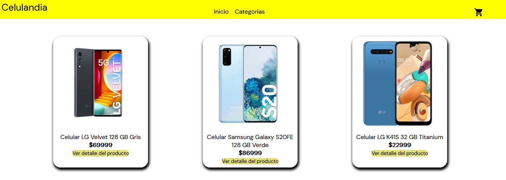
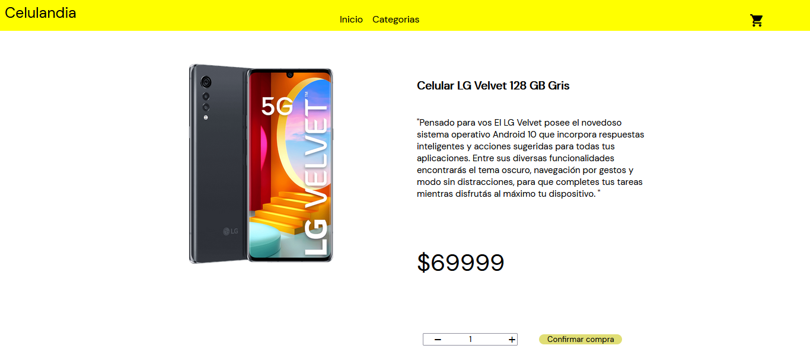

# E-commerce - tienda de celulares

## Descripcion del proyecto
**celulandia** es una tienda online donde vas a poder simular la compra de productos, eligiendo la cantidad, completando un formulario con tus datos y obteniendo el id de tu compra. Toda la informacion de la compra se guarda en firebase.
***
### ¿Como usar la tienda?
La pagina tiene una interfaz muy facil de usar, donde en la pagina de inicio encontraras todos los productos y una seccion de **Categorias** donde vas a encontrar las marcas de los productos para poder acceder mas rapido.
Al clickear un producto veras el detalle del mismo, donde vas a poder agregarlo al carrito , terminar la compra o seguir comprando.  
En el carrito se va detallar el producto, el nombre, la cantidad y el precio. Si el cliente quiere sacar un producto en particular lo podra hacer o si quiere quitar todos tambien, ya que al quitar todos le aparecera un boton para volver al inicio.
Cuando se finalize la compra el cliente tendra que llenar un formulario con sus datos y se le mostrara en pantalla su **id** de compra ,luego de eso el cliente podra volver a la pagina principal.

***
#### Instalacion
`npm install`

#### Uso
`npm start`